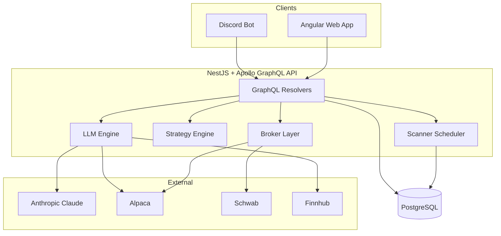
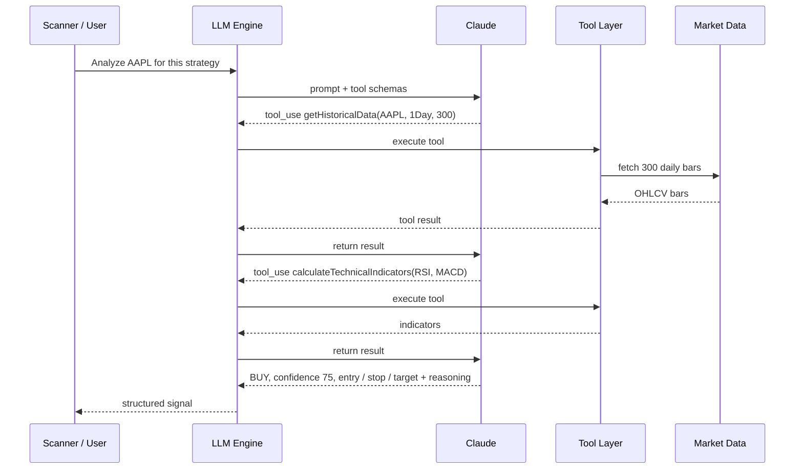
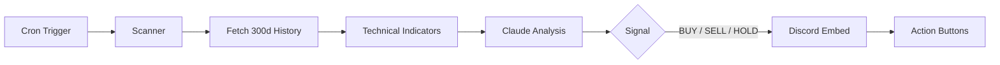
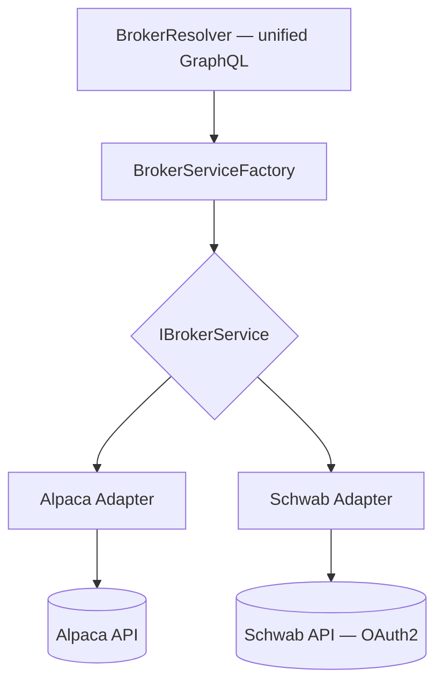

Stonkss AI is a personal project I built to explore two things I wanted to
understand deeply: **agentic LLM tooling** and **trading systems** — end to end,
in one codebase. The goal wasn't to get rich; it was to answer a concrete
engineering question: *what does it actually take to let an LLM reason over live
market data and act through real brokerage APIs, safely?*

The result is a full-stack platform: a NestJS + GraphQL API, an Angular web
client, a Claude-driven analysis engine with real tool-calling, a strategy and
scanner engine, and a Discord bot — all wired to the Charles Schwab and Alpaca
brokerages. Here's how it fits together, and the decisions I'd defend.

## The shape of the thing

Everything lives in an **Nx monorepo** — `stonkss-api` (NestJS), `stonkss-web`
(Angular), and a Playwright e2e project — sharing types across the boundary.
Postgres via TypeORM (with Rails-style migrations) is the system of record.


<span class="mermaid-caption">One GraphQL API fronts four cooperating subsystems; brokers and market-data providers sit behind their own layers.</span>

The interesting parts aren't the CRUD — they're the three layers that had real
design tension: the **AI tool layer**, the **strategy/scanner engine**, and the
**broker abstraction**.

## Giving Claude tools, not just prompts

The naive version of "AI trading analysis" is: stuff some numbers into a prompt
and ask for a verdict. I wanted the stronger version — **let the model decide
what data it needs and go get it** via tool-calling.

So I defined a provider-agnostic tool interface. Every tool declares a schema and
knows how to execute itself:

```typescript
export interface LLMTool<TParams, TResult> {
  readonly schema: LLMToolSchema;
  execute(params: TParams, context: LLMToolContext): Promise<LLMToolResult<TResult>>;
}
```

The tools I built give the model everything it needs to do real analysis:

- `getHistoricalData` — OHLCV bars for a symbol/timeframe (Alpaca).
- `calculateTechnicalIndicators` — RSI, MACD, moving averages, support/resistance, Fibonacci.
- `getMarketContext` — live quotes, positions, orders, account state, market open/closed.

The piece I'm happiest with is the **schema converter**. Tools are defined once
in a generic `LLMToolSchema`, then converted to whichever provider format is
needed — OpenAI's `function` shape or Anthropic's `input_schema` — so the same
tool definition works across models:

```typescript
toAnthropic(schema: LLMToolSchema): AnthropicTool {
  return {
    name: schema.name,
    description: schema.description,
    input_schema: {
      type: 'object',
      properties: this.convertParameters(schema.parameters),
      required: schema.requiredParameters,
    },
  };
}
```

With the tools registered, an analysis becomes an agentic loop: Claude asks for
data, I execute the tool, feed the result back, and it decides what to fetch next
before committing to an answer.


<span class="mermaid-caption">Claude drives the data-gathering; the engine just executes tools and returns results until the model commits.</span>

## From strategy to signal

A model that answers one-off questions isn't a system. The scanner engine turns
it into something that runs on its own.

The data model is three levels: a **TradingStrategy** captures the rules — risk
tolerance, position sizing, indicator config, and an AI personality — and a
**Scanner** points that strategy at a set of symbols on a cron schedule, with
each **ScannerSymbol** tracked individually.


<span class="mermaid-caption">A scheduled scan fetches data, computes indicators, asks Claude, and surfaces a color-coded signal with action buttons.</span>

Two decisions here mattered:

1. **A real rules engine sits alongside the AI.** Entry and exit conditions are
   evaluated by dedicated services (condition evaluators, aggregators, filters) —
   not everything is "ask the model." The AI adds judgment on top of
   deterministic technical analysis, rather than replacing it.
2. **The AI path degrades gracefully.** If Claude is unavailable or returns
   something unparseable, the analysis service falls back to a mock
   recommendation instead of taking down the scan. An external dependency on the
   critical path should never be a single point of failure.

The output is a structured signal — recommendation, confidence (0–100), entry,
stop-loss, take-profit, and a one-line rationale — which the Discord layer
renders as a rich, color-coded embed with interactive buttons.

## One interface, two brokers — and knowing when to stop

Schwab and Alpaca have different APIs, auth models (Schwab is OAuth2), and data
shapes. I wanted the rest of the system to not care, so I put a **broker
abstraction** in front of them:


<span class="mermaid-caption">A single GraphQL surface routes through a factory to per-broker adapters implementing one interface.</span>

`IBrokerService` covers the genuinely universal operations — accounts,
positions, quotes, orders. Add a broker by implementing the interface; nothing
downstream changes.

But the more interesting story is where I **deliberately broke the abstraction.**
I'd originally pushed a `brokerProvider` parameter through everything, including
provider-specific features like Alpaca's historical-data endpoints. That created
optional-parameter explosion and leaky types for a generality I wasn't using. So
I pulled back: universal operations stay behind the generic interface, and
provider-specific capabilities live in dedicated resolvers with their native
types. Abstraction where it pays, concreteness where it doesn't — recognizing the
difference is the actual skill.

## Keeping the keys safe

Users bring their own LLM and broker credentials, which means the system holds
secrets. All API keys are **encrypted at rest with AES-256-GCM**, scoped per
user, with support for **zero-downtime key rotation**. It's a personal project,
but "it's just me" is exactly the mindset that leaks credentials — so I treated
it like it wasn't.

## What I took away

Building this end to end changed how I think about LLM features. A few things
stuck:

- **Tool-calling beats prompt-stuffing.** Letting the model request data on
  demand produced better analysis than pre-loading everything, and the
  provider-agnostic tool layer made swapping models trivial.
- **Keep a human in the loop for anything irreversible.** Orders route through
  the broker layer, but the Discord flow surfaces a *confirmation* step rather
  than one-click auto-execution. The last mile of full automation is where I
  slowed down on purpose.
- **Abstractions have a cost.** The broker layer taught me more by being *partly*
  walked back than it would have as a pristine, over-general design.

Stonkss AI is exploratory by design — built around paper trading and real
brokerage sandboxes — but every layer is production-shaped. If I picked it back
up, the next step would be closing that automation loop with proper guardrails:
position limits, circuit breakers, and an audit trail before any dollar moves
without me watching.
